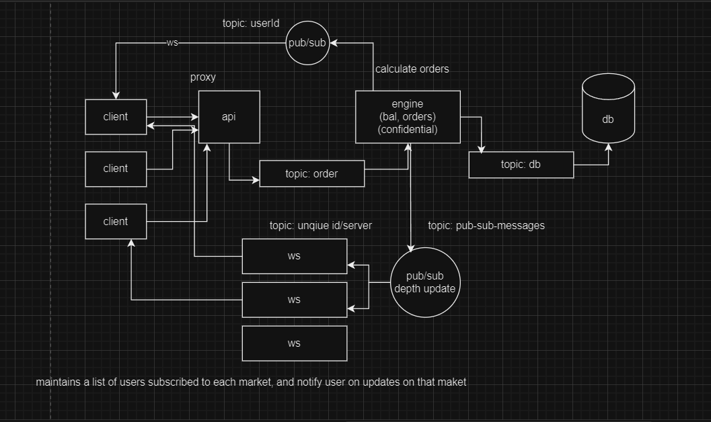

# Exchange Backend

A backend application for a cryptocurrency exchange similar to Binance, where users can place orders and receive real-time updates on the order book using WebSockets. The application ensures synchronous operations for order processing and uses Redis for message queuing and pub/sub mechanisms to manage communication between the proxy server and the backend engine.

## Table of Contents

- [Features](#features)
- [Technologies](#technologies)
- [Architecture](#architecture)
- [License](#license)

## Features

- User authentication and balance management
- Order placement and real-time order book updates
- Synchronous operation processing to ensure sequential handling of tasks
- Proxy server to protect the backend engine from attacks
- WebSocket servers for real-time communication
- Redis message queue for communication between proxy server and backend engine
- Redis pub/sub for publishing order book updates and subscribing WebSocket servers

## Technologies

- **Backend**: Node.js, Express, MongoDB, Redis
- **Real-time Communication**: WebSockets, Redis pub/sub

## Architecture

- **Proxy Server**: Protects the main backend engine from direct user access and handles initial request validation.
- **Backend Engine**: Contains the main logic for order processing, balance management, and synchronous operation handling.
- **Redis**: Used as a message queue for communication between the proxy server and the backend engine, and as a pub/sub system for real-time order book updates.
- **WebSocket Servers**: Subscribe to Redis pub/sub channels to receive market updates and forward them to users.

## License

This project is licensed under the MIT License - see the [LICENSE](LICENSE) file for details.
